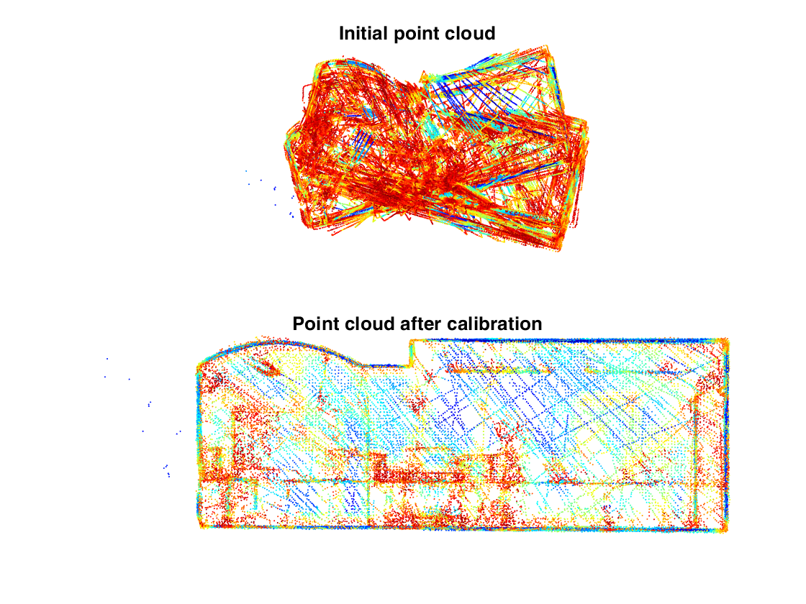

# FeatCalibr
FeatCalibr is a Matlab-Toolbox for automatic extrinsic self-calibration based on geometric 3D-features. FeatCalibr estimates the rigid transformation between a 6-DOF pose estimation sensor (e.g. GPS/INS, Camera + visual odometry/SLAM, Motion Capture System, etc.) and a mapping sensor (e.g. a 2D/3D laser scanner, depth camera, stereo camera, etc.) without using special calibration objects such as a checkerboard.

## References
Details to the calibration approach can be found in the following paper:

Markus Hillemann, Martin Weinmann, Markus S. Mueller, Boris Jutzi. Automatic Extrinsic Self-Calibration of Mobile Mapping Systems Based on Geometric 3D Features. Remote Sensing, 11(16):1955, 2019.

Please cite the paper when using FeatCalibr or parts of it in an academic publication.

## Dependencies
The current version of FeatCalibr requires the following MATLAB toolboxes:

* Optimization Toolbox
* Statistics and Machine Learning Toolbox
* Computer Vision Toolbox (for downsampling and displaying point clouds)

Optional:

* Parallel Computing Toolbox (to accelerate the computations.)

## Usage
Run the script 'runFeatCalibr.m' to see an example.
